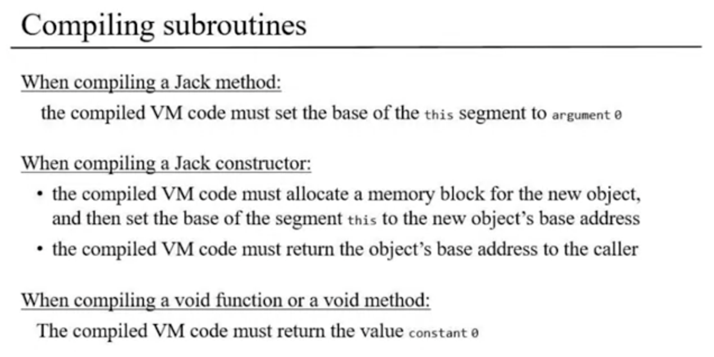
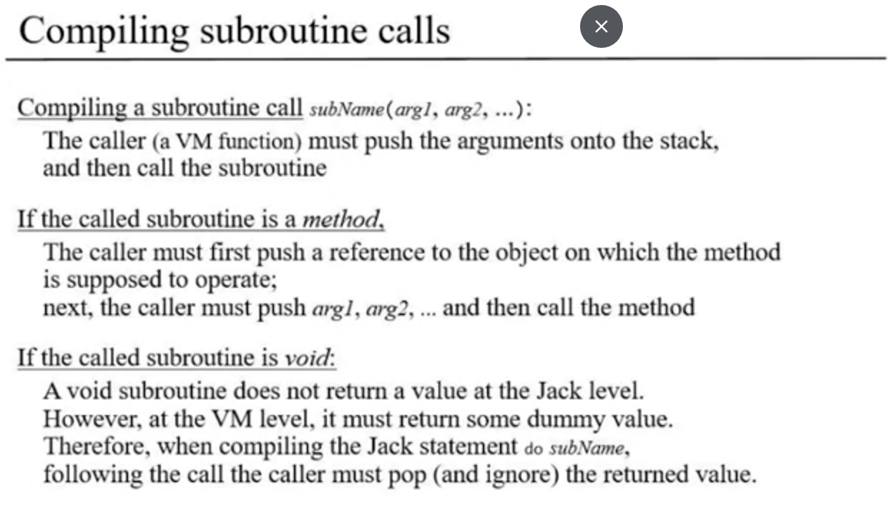
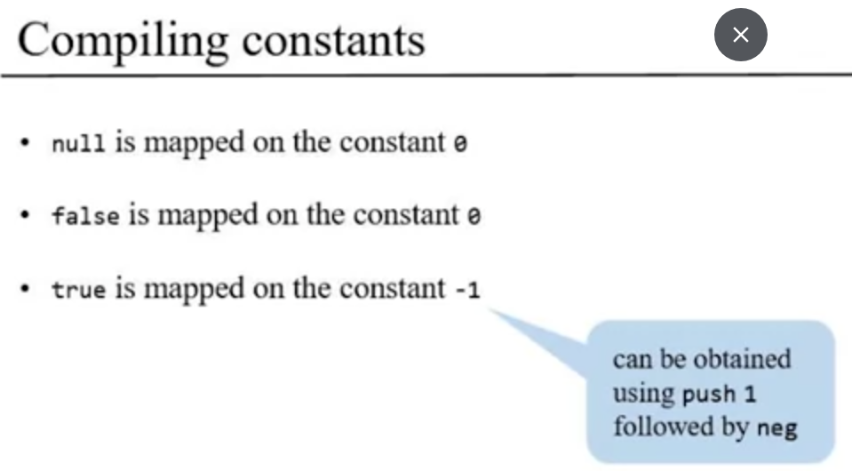
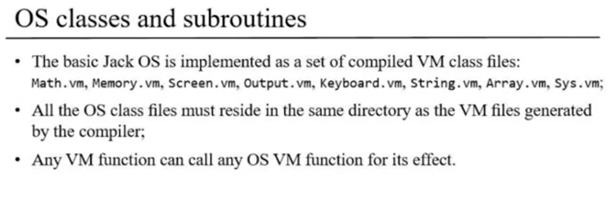
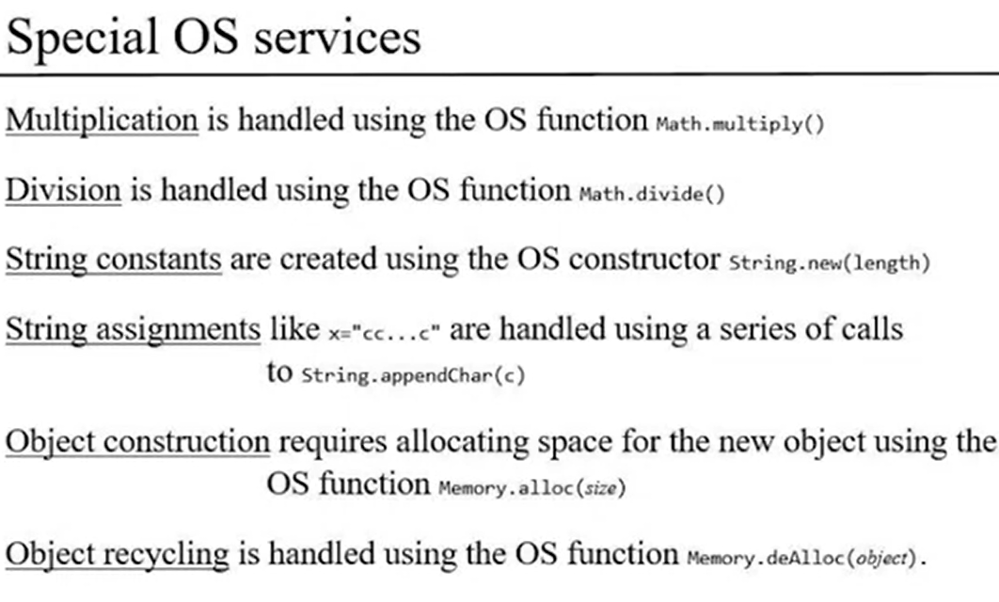
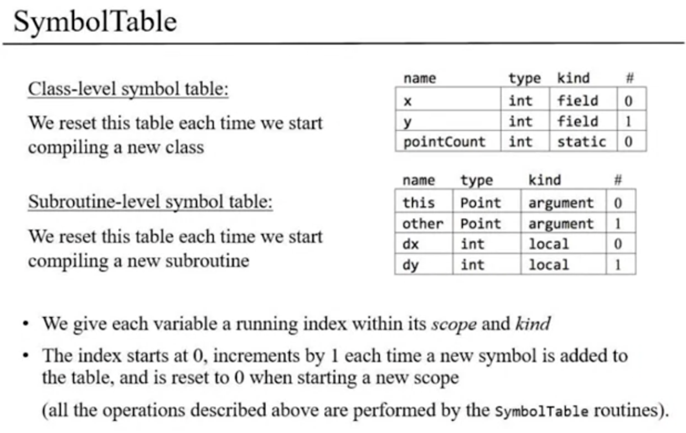
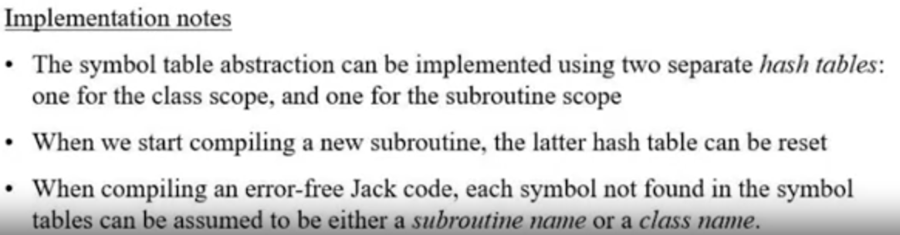

===== 5.1 =====
- Each jack file compiled alone.
- Compiling of each class can devied into:
    - Compiling all variable declared in the class with each other lonly.
    - Compiling each subroutine of the class lonly.
- Our compilation challenges:
    - Handling variables.
    - Handling expressions.
    - Handling flow of control.
    - Handling objects.
    - Handling arrays.

===== 5.2: Handling variables =====
with cmmand like: sum = x * 6 + i;
- We have a problem with:
    - determin each variable segment (static, field, local, argument).
    - Determin each varialbe order in it's segment.
- Example:
    Jack code            | psudo VM code | VM code              |
    -------------------------------------------------------------
    sum = x * (1 + rate) | push x        | push argument 2      | // assume that x is the 3rd variable in argument segment.
                         | push 1        | push constant 1      | 
                         | push rate     | push static 0        | // assume that rate is the 1st variable in static segment.
                         | +             | add                  |
                         | *             | call Math.multiply 2 |
                         | pop sum       | pop local 3          | // assume that sum is the 4th variable in local segment.
- To handle variables we can devid them in two parts:
    - class-level variables: 
        - field.
        - static.
    - subroutine-level variable:
        - argument.
        - local.
- variable properities:
    - name.
    - type.
    - kind.
    - scope.
- variable properities with Jack:
    - name (identifier).
    - type (int, char, boolean, className).
    - kind (field, static, local, argument).
    - scope (class level, subroutine level).

- We can use symbole table to handle variables decleration, example:
Jack Code:
    class Point {
        field int x, y;
        static int pointCount;

        method int distance(Point other)
        {
            var int dx, dy;
            // some statements
        }
    }
Symbole table for the previous Jack code [class-level variables]:
    | name       | type | kind   | # |
    | x          | int  | field  | 0 |
    | y          | int  | field  | 1 |
    | pointCount | int  | static | 0 |

Symbole table for the previous Jack code [subroutine-level variables]:
    | name       | type  | kind     | # |
    | this       | Point | argument | 0 | // it's always the first argument of all subroutines with constructor 'method'.
    | other      | Point | argument | 1 |
    | dx         | int   | local    | 0 |
    | dy         | int   | local    | 1 |

- Because we compile classes speratly we can git red of Symbole table of class-level variables, after finishing compiling of the class.
- Because we compile subroutines seperatly we can git red of Symbole table of subroutine-level variables, after finishing compiling of the subroutine.

- Handling variable usage:
when you find a variable in any expressions, or let statement you can do the following in order:
    1. Search the variable in the Symbole table of subroutine-level, if you find then it's ok. else,
    2. Search the variable in the Symbole table of class-level, if you find then it's ok, else,
    3. you may want pass error with undefined variable.

#Note: in the decleration phase there no VM code generated, it's just updating the Symbole table, but in usage phase there is 
        VM code should be generated.
____________________________________________________________________

===== 5.3: Handling expressions =====
- Expression in Jack example:
x + y * (5 + sum(2,4))
- to make the compiling for expression easier we will use parsing tree:
    +
x       *
    y       +
        5       sum
            2       4
- we will not parse in this way, we will use another methodology:
- we will create function called: codeWriter(exp);
== if exp is a number n: output "push n".
== if exp is a variable var: output "push var".
== if exp is "exp1 op exp2": codeWriter(exp1), codeWriter(exp2), output "op".
== if exp is "op exp1": codeWriter(exp1), output "op".
== if exp is "f(exp1, exp2, ...)" codeWriter(exp1), codeWriter(exp2), ..., output "call f".
#Note: the expression between parantheses () should have periority to fully done (may be compiling) before the rest of expression.
#Note: for you, you have anothe compilert architechture so I think it's good to understand this, but create what you find easier and faster.
____________________________________________________________________
===== 5.4: Handling flow of control =====
- When we need to control flow in Jack (if/while), we tread with flow control in VM (goto, if-goto, label).
- Compiling if statement:
- If statement structure in jack:
    if(expression)
        statements1
    else
        statements2
- If statement compiling in VM:
    compiling(expression)
    not
    if-goto L1
    compiling(statements1)
    goto L2
label L1
    compiling(statements2)
label L2

- Compiling while statement:
- while statement structure in jack:
    while(expression)
        statements

- while statement compiling in VM:
label L1
    compiling(expression)
    not
    if-goto L2
    compilation(statements)
    goto L1
label L2

#Note: you need to generate unique labels to make no confusing between flow labels.
____________________________________________________________________
===== 5.5: Handling objects =====

- this, that segments: 
- represent object and array data.
- locate on the heap.
- Implementation:
- Base address: THIS and THAT.
- Set use:
    - pointer 0 (this)
    - pointer 1 (that)
- managed by VM.

#Note: this segment used to manage objects, and that sement used to manage arrays.
____________________________________________________________________
===== 5.6: Handling objects more (Construction) =====
- this is example of Jack code with vm compiling for the object from the caller prespective:
- The full view of the Jack code:
    var Point p1;
    let p1 = Point.new(2, 3);
- The compilation of each line with VM:
    // var Point p1;
    # in decleration there no VM code, it just updating for the Symbol table.
    // let p1 = Point.new(2, 3);
    push 2
    push 3
    call Point.new // we assume that any constructor function should return the location of the created object.
    pop p1;

- what is the constructor function task:
- Arrange the creation of new object.
- Initialize the new object to some intial state therefore, the constructor code need typicaly to access to object's field.
- How the constructor can access the object's field:
- first constructor code must anchore the this segment to object's data, using pointer.
- then constructor can access object's data using the this segment.

- this is example of Jack code with vm compiling for the object from the callee prespective:
- The full view of the Jack code:
    class Point {
        field int x, y;
        static int pointCount;

        constructor Point new (int ax, int ay)
        {
            let x = ax;
            let y = ay;
            let pointCount = pointCount + 1;
            return this;
        }
    }
- The compilation of each line with VM:
    /*
        field int x, y;
        static int pointCount;
    */
    #In this phase of variable decleration there no VM code, it's just building Symbols table. 

    // constructor Point.new(int ax, int ay)
    push 2 // Note the 2 is the number of the field variables in the class.
    call Memory.alloc 1 // We assume that we have api from the OS that search in the heap and find place to save the object fields.
                        // Note also that number 1 is the number of the arguments the functiong will take.
                        // This function return the first regester address from the segment allocated.
    pop pointer 0 // set this to the location returned from 'Memory.alloc'

    // let x = ax;
    push argument 0; // Note that 0 here is the location of the argument accourding to the Symbols table of the subroutine.
    pop this 0; // Note that 0 here is the order of the field 'x' in symbols table.

    // let y = ay;
    push argument 1;
    pop this 1;

    // let pointCount = pointCount + 1;
    push static 0
    push constant 1
    add
    pop static 0 // the 0 is the order of the pointCount as a static variable in the symbols table.

    // return this
    push pointer 0
    return // Note to return any value in function in VM, we push the returned value first and wrtie command: 'return'.

____________________________________________________________________
===== 5.7: Handling objects more (Manipulation) =====
We mean with word 'manipulation': how the object treat with it's methods.
- Now we have 2 part of manipulation:
- 1st: Caller side, example: do p1.distance(p2);
    - I will translate this code to VM code:
        // do p1.distance(p2)
        push p1 // Note her we treate with distance as method have 2 arguments not just one, ant the object it self is the 1st argument.
        push p2
        call Point.distance 2 // note here that when rename the method to contain 2 parts: [className].[methodName]
                              // so you may ask how to name method in this way when compiling
                              // I thik it's easy, the first part can we get from the type of the object in symbols table
                              // but if the subroutine is already a 'function' not 'methos' so it's called with class name.
                              // In this time when we search for the firtst part as object defined before and we can't find,
                              // then we can assume it's a class try to call it's 'function'.
- 2nd: Callee side:
this is example of Jack code:
class Point {
    field x, y;
    static int pointCount;

    method int distance(Point other)
    {
        var int dx, dy;
        let dx = x - other.getx();
        let dy = y - other.gety();
        return Math.sqrt((dx*dx) + (dy * dy));
    }
}
    - 1st thing you need to know is the method of any object need to access to object field, so how we can do that:
        We all ready know that each method have 'this' as a 1st argument.
        we know also that 'this' contain the address of the object in RAM
        so to access any field we need just say 'this n' and n is refere to the field order.
    - Here i will write code with Jack and translate it to VM code:
    *jack code:*
        class Point {
        field x, y;
        static int pointCount;

        method int distance(Point other)
        {
            var int dx, dy;
            let dx = x - other.getx();
            let dy = y - other.gety();
            return Math.sqrt((dx*dx) + (dy * dy));
        }
    *VM code:*
        // field x, y;
        // static int pointCount;
        in the part of decleration variables in class lavel we just put them in symbols table.

        // method int distance(Point other)
        // var int dx, dy;
        in the part of deleration varibles in subroutine level we just put them in symbols table.
        But in the of each 'method' we need to assign 'this' keyword to the object address:
        push argument 0 // Note: that in any 'method' argument 0 is should exist and it containt the object address, and called 'this'
        pop pointer 0 // Assign the value of argument 0 to 'this'

        // let dx = x - other.getx();
        push this 0 // the 0 is the number of 'x' as a field variable in symbols table.
        push argument 1 // the 1 is the number of 'other' variable as an argument in symbols table.
        call Point.getx 1
        sub
        pop local 0

        // and so on
        in the end of VM code for any function we should have return key word.
        return #Note: there 2 cases for return:
                1st: you have expression after return like in our example in this case you compile the expression first
                        and then compile return keyword to 'return' in VM.
                2nd: you compile void function that end with void word, with out any expression, in this case you will do that:
                    push constant 0
                    return
                    // in the context of compiling do someMethod(); after compiling the method part ot VM we write:
                    pop temp 0 // we do that because the we need to get red of the returned valuo of the method part.
                               // so the returned value in call stack will removed and move to the first register of temp segment.
____________________________________________________________________
===== 5.8: Handling arrays =====
- Handling arrays contain 2 parts:
1st: Handling arrays from constructor prespective:
    - This is Jack code:
        var Array arr;
        let arr = Array.new(4);
    - This is VM compiling for Jack code:
        // var Array arr;
        No cade here just put the decleration to the symbol table.
        // let arr = Array.new(4)
        Handling like you handle any object.
        The os task here is to reserve sequence of free number of regesters in the memory. // #Note: this is not your task in the calling process, it should be the tast of the body of the constructor fanction of Array class.
        The regesters number is equal to the resolt of the expression in the new method of array, her equal 4, so the os should reserve 4 regesters.
2nd: Handling arrays form manipulation prespective:
    - This is Jack code:
        arr[2] = 7;
    - This is VM compiling for Jack code:
        // arr[2] = 7;
        push arr // not here you push the location that you get when you call the constructor
        push 2
        add // here we add 2 to the address to determine the index register address
        pop pointer 0 // assign that to the new address
        push 17
        pop that 0 // also will be 0, because in each time we assign That to the specific indexing address.
    - If we write the code in abstract way and compile it to VM, will be like:
        // arr[exp1] = exp2;
        push arr
        push exp1
        add
        pop pointer 0
        push exp2
        pop that 0
        
        // This compilation will not work if the exp2 is someArr[exp2], so to compile: arr1[exp1] = arr2[exp2]:
        push arr1
        push exp1
        add         // here we add the first address to the stack // arr1[exp1]
        push arr2
        push exp2
        add         // here we add the 2nd address to the stack // arr2[exp2]
        pop pointer 1 // her I connect that to the 2nd address, and remove 2nd address from the statck
        push that 0 // save the value of the 2nd address content in the stack
        pop temp 0  // move the value of the 2nd address content that on stack to temp segment.
        pop pointer 1 // now that point to 1st address, and remove the address value from the stack
        push temp 0 // Mote the value that saved in temp segment again to the stack
        pop that 0 // save the top value in the stack in the 1st address register.
        
        // So when I want to update the compilation of this command: arr[exp1] = exp2; will be:
        push arr
        VM code for compiling exp1 and push it
        add
        VM code for compiling exp2 and push it
        pop temp 0
        pop pointer 1
        push temp 0
        pop that 0
____________________________________________________________________
===== 5.9: Standard Mapping over the VM =====
- Files and subroutines Mapping
- Jack file: Main.jack conveted to Main.vm when compiling.
- When compiling subroutines of class, we convert them to: function ClassName.subroutineName
- Whan compiling each subroutine arguments number in jack language will be the same in VM except subroutines with 'method' constructor
    it's arguments in VM will be k+1 (k: is the number of argument of the method in jack).
- Variable Mapping:
- The local (subroutine vars) variables maped on VM segment local.
- The parameter variables mapped on VM segment argument.
- The static varibles mapped on VM segment static
- The field variables of the current object are accesses as following:
    - assumption: we set the this key word to the object content address by pointer 0
    - the i-th field of this object is mapped on 'this i'.
- Arrays Mapping:
Access to any array entry arr[i] is realized as follows:
- 1st set pointer 1 to the enrty's address (arr + i).
- access the entry accessing 'this 0'
- Compiling subroutines

- Compiling subroutines call

### Note: in the call of void method, we can ignore the returned value by: pop temp 0.
- Compiling constants

- OS class & subroutines

- Special os services

____________________________________________________________________
===== 5.10: Completing the Compiler: Proposed Implementation =====
- Symbole Table:

### What I think about way to implement it:
> I think that may Symbole Table be a static and contain 2 parts: classScope & routineScope
> I think also Symbole table can contain method like:
> - resetClassScope 
> - resetRoutineScope
> - addVar(name, type, kind)
> - getVar(varName) => May there will be a SymboleItem and its teh return of this function.
#### Her is implementation notes for symbole tables:

- VMWriter:

### Note: you can develop you compiler gradually by using projects in foledr '11' in the order of the lecture (start form: 11:10)
____________________________________________________________________